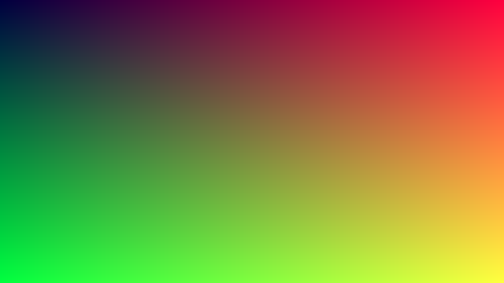
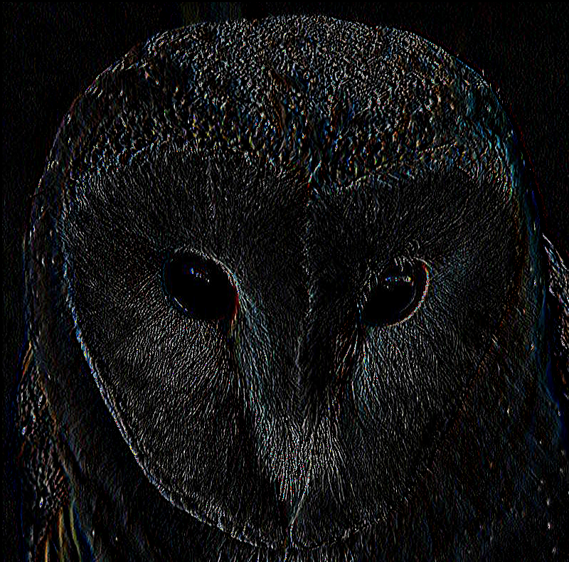
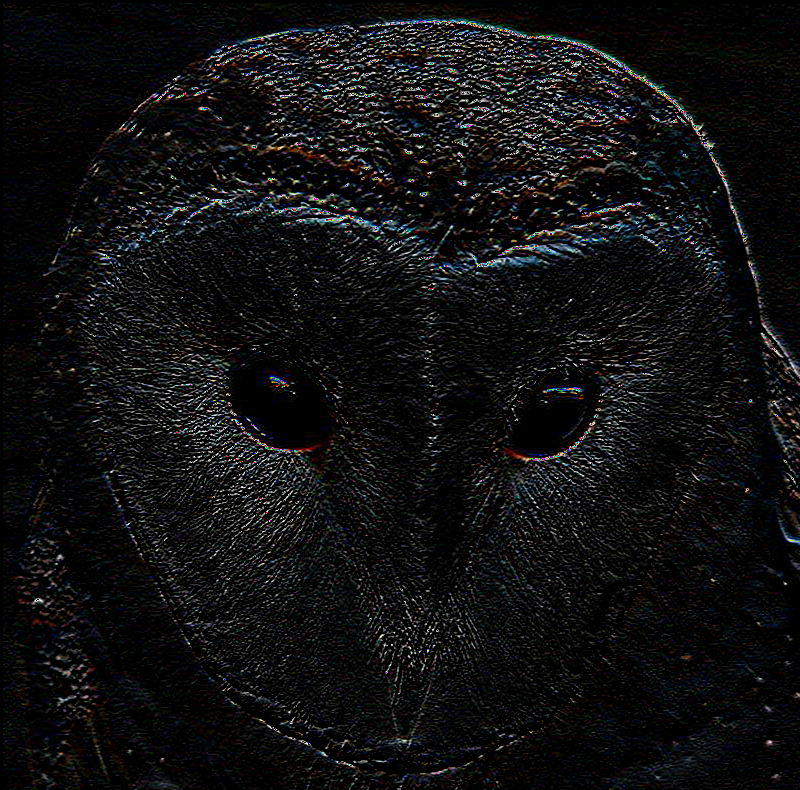
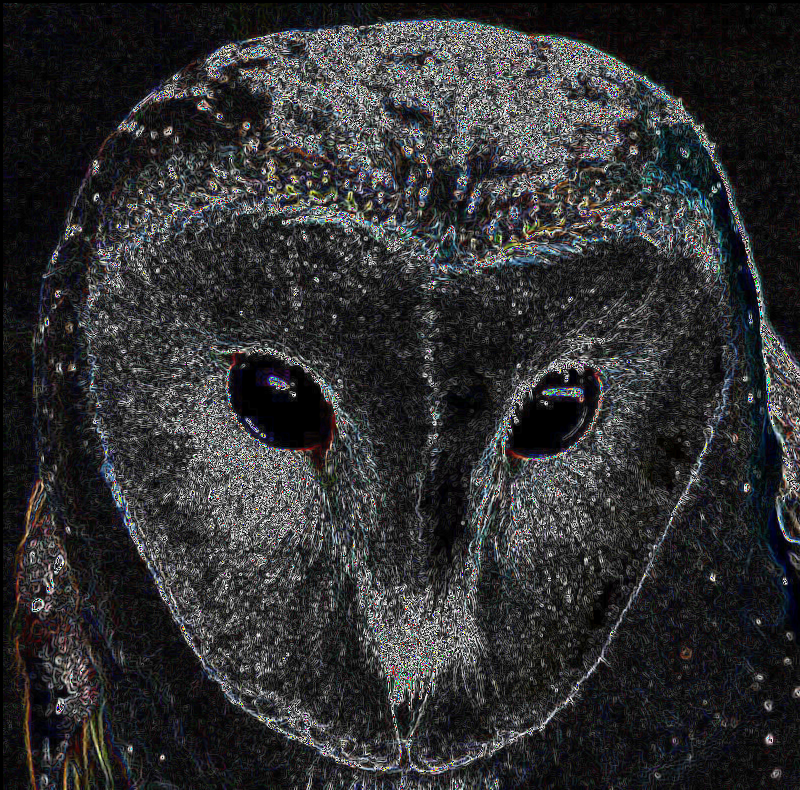

# cuda-improc: Image processing with CUDA

Basic kernels for image processing with NVIDIA® CUDA® Toolkit. We haven't put
any particular effort to make these kernels efficient, hence they serve mainly
as a demonstration rather than a canonic implementation.

## Examples

- Image Gradient: 
  - [gengrad.cu](src/gengrad/gengrad.cu): single stream gradient
  - [asyncgengrad.cu](src/gengrad/asyncgengrad.cu): basic image gradient where each
    channel is generated by a separate cuda stream.
  - `gengrad.cu` image:  
  - `asyncgengrad.cu` image:  

- Sobel3x3 Filter:
  - [sobelx.cu](src/edged/sobelx.cu): 3x3 sobel operator applied in x
    direction. Since it is a linear filter, we separate its application to
    each channel to a separate cuda stream.
  - [sobely.cu](src/edged/sobely.cu): 3x3 sobel operator applied in y
    direction.
  - [sobelxy.cu](src/edged/sobelxy.cu): 3x3 sobel operator applied in both
    directions.
  - source image: 
  - `sobelx.cu` image: 
  - `sobely.cu` image: 
  - `sobelxy.cu` image: 

